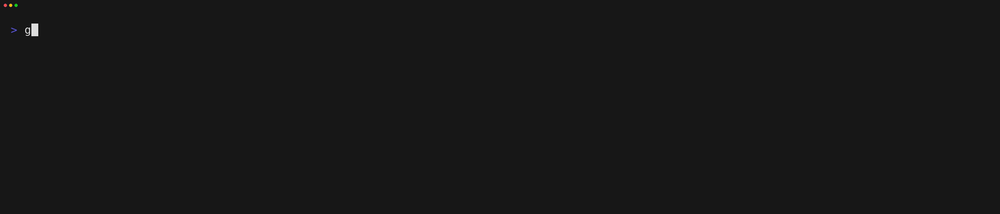

# 🐐 goat &nbsp; [](https://github.com/studio-b12/goat/releases) [](https://studio-b12.github.io/goat)  [](https://github.com/studio-b12/goat/actions/workflows/tests.yml)

goat *(**Go** **A**PI **T**ester)*, a CLI tool to simplify and automate integration testing of HTTP APIs by using script files.



> Example Goatfile
```
use util/login

### Setup

LOGIN {{.instance}}/api/v1/auth

[Header]
Content-Type: application/json

[Body]
{ 
    "username": "{{.username}}",
    "password": "{{.password}}"
}

[Script]
assert(response.StatusCode == 200, `Status code was ${response.StatusCode}`);

---

### Tests

GET {{.instance}}/api/v1/list

[Script]
assert(response.StatusCode == 200, `Status code was ${response.StatusCode}`);
print(response.Body);
```

This tool is very much inspired by [Hurl](https://hurl.dev). Please give them a visit and evaluate what fits best for you.

## But why?

goat has some advantages versus common tools like Postman or Insomnia.

- Write your API tests in easy to read and write, simple text files.
- Build easy to reproduce end to end tests which you can directly commit with your source code.
- Build for being used headlessly in CI/CD systems.
- Easy to install due to being one single, self contained binary.
- Goatfiles can be read, written and understood using any type of text editor.
- High level of flexibility due to the usage of a micro script engine (JavaScript) for assertions. 

## Getting Started

### Installation

If you have the Go toolchain installed, you can simply install the tool via `go install`.
```
go install github.com/studio-b12/goat/cmd/goat@latest
```

Otherwise, you can also download the binaries from the [Releases Page](https://github.com/studio-b12/goat/releases).

### Goatfile

Now, you can dive in to create your first Goatfile. You can find more information on how Goatfiles work in the [**documentation book**](https://studio-b12.github.io/goat/).

You can also simply generate an example Goatfile using the following command.
```
goat --new
```

There, you can define your setup, teardown and test requests as you desire.

Take a look into the more detailed [CLI Manual](https://studio-b12.github.io/goat/command-line-tool/index.html) to find out more.

## Language Support

There is currently a very early prototype extension for Visual Studio Code adding syntax highlighting for Goatfiles. here you can find more informations about that: https://github.com/studio-b12/goat-vscode.

## Contribute

If you find any issues, want to submit a suggestion for a new feature or improvement of an existing one or just want to ask a question, feel free to [create an Issue](https://github.com/studio-b12/goat/issues/new).

If you want to contribute to the project, just [create a fork](https://github.com/studio-b12/goat/fork) and [create a pull request](https://docs.github.com/en/pull-requests/collaborating-with-pull-requests/proposing-changes-to-your-work-with-pull-requests/creating-a-pull-request) with your changes. We are happy to review your contribution and make you a part of the project. 😄

---

© 2023 B12-Touch GmbH
https://b12-touch.de

Covered by the [BSD 3-Clause License](LICENSE).
