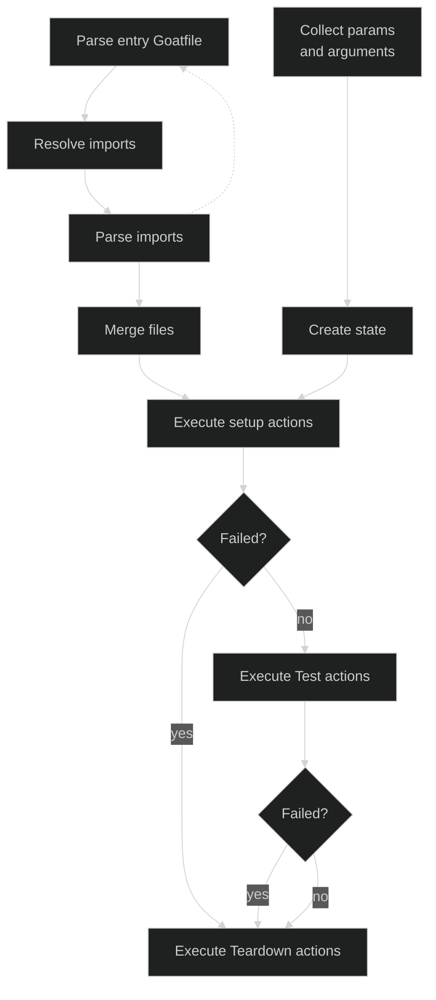
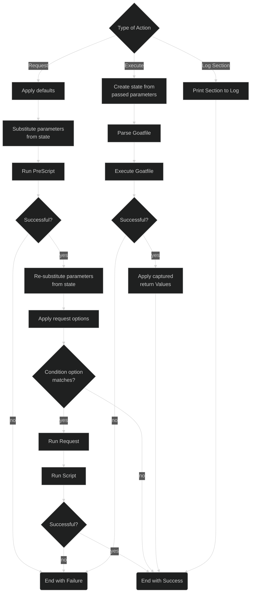

# Lifecycle

In this section, you will learn the basics on how exactly batches and requests are executed and when which section of a batch or test is evaluated.

## Sections

First of all, a batch consists of four logical sections.

- **`Default`**: Contains default request parameters which are passed on to each executed request in the batch. This is the only section which does not actually execute actions and supports partial request fields.

- **`Setup`**: Contains actions which should be executed before the actual test steps are ran.

- **`Tests`**: The actual test actions.

- **`Teardown`**: Steps that are run after the test executions, e.g., to clean up stuff from the `Setup` and `Test` sections.

## Batch Lifecycle

Below, you can find a simplified schematic of how a single test batch is executed.

Every batch begins with a single entrypoint Goatfile *(if you execute Goat on a folder of Goatfiles, each Goatfile in that folder will be seen as an entrypoint Goatfile and the batch execution will be executed indiviually for each file)*. 

First, all imported *(see [`use`](../goatfile/import-statement.md))* Goatfiles are resolved, parsed and merged together with the entrypoint Goatfile to one single batch execution. So all `Default`, `Setup`, `Test` and `Teardown` entries are merged together for each file.

"Simultaneously", all parameters are collected from passed parameter files, environment variables and arguments *(see [Command Line Tool](../command-line-tool/index.md#flags))*. These form the initial state.

After that, all `Setup` actions are executed. If any setup action has failed, the rest of the setup and the entire `Test` section is skipped. Finally, all teardown steps are executed and the batch exits in a failed state summarizing all errors that occurred.

If the `Setup` has completed successfully, the `Test` section is executed. Just as in the `Setup` section, if any of the `Test` actions fails, the entire section is skipped, the teardown actions are executed and the batch exits in a failed state.

If the `Test` section has completed successfully, the `Teardown` section is executed. Here, if any action fails, the execution **continues** instead of skipping the rest of the actions to ensure a complete cleanup as intended. If any of the `Teardown` actions fail, the batch execution will result in a failed state as well.

## Action Lifecycle

Below, you can see a simplified lifecycle diagram of the three actions `Request`, `Execute` and `Log Section`.

### Request

A `Request` action begins with the application of all default parameters from the `Default` section of the batch. After that, the parameters from the current state are substituted for the template parameters in the request definition. With the resulting state, the `PreScript` section is executed. If the execution failed, the request ends with a failure state. Otherwise, the new state is extracted and all templates are re-substituted using the new state. Following this, the request options are evaluated and applied. If the option `condition` evaluates to `false`, the request is skipped which ends the request in a success state. Otherwise, the actual request is now executed. Finally, the `Script` section is executed using the current state. Depending on the result, the request will end with a failure or success state.

### Execute

An `Execute` action "calls" another Goatfile with specified parameters and capture values. The defined parameters are used to initialize a new state. After that, the referenced Goatfile is parsed and executed with this new state. This execution is a whole new [Batch](#batch-lifecycle) execution in itself.

If this batch execution fails, the action results in a failed state as well. If it is successful, the defined values to be captured in the `return` statement are merged with the current state of the executing batch.

### Log Section

A `Log Section` is simply an action that prints a visual separator as `INFO` entry into the log to visually separate between test sections. This should never result in a failed action state.
