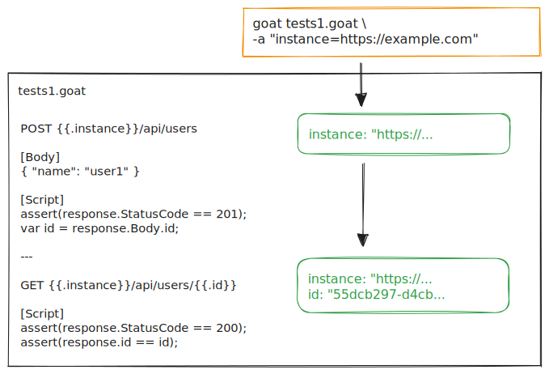

# State Management

Goat initializes a state for every Goatfile execution. A state initially consists of the passed parameters which were either passed via a configuration file, via environment variables or via the `--args` CLI parameter.

This state is then passed to every request in the executed Goatfile. The request can read and alter the state.
When one request has finished, the state is passed into the next request, and so on until the execution has finished.

Below, you can see a very simple example of how a state lifecycle could look like.

## State with `use`

Because `use` effectively merges the imported Goatfile together with the root Goatfile to a single batch execution, state is shared between them. So if you define a variable in a Goatfile imported via `use`, the variable will be accessible in subsequent imported Goatfiles as well as in the root Goatfile.

## State with `execute`

Executed Goatfiles in another Goatfile via the `execute` command will handle the executed Goatfile like a separate batch and thus it will create and use a separate state. 

<!-- TODO: Add link to the use statement in Goatfile section, when created. -->
