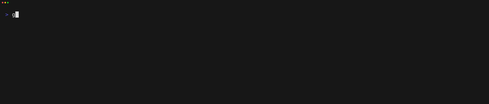

# 🐐 Goat

goat *(**Go** **A**PI **T**ester)*, a CLI tool to simplify and automate integration testing of HTTP APIs by using script files.



> Example Goatfile
> ```
> use util/login
> 
> ### Setup
> 
> LOGIN {{.instance}}/api/v1/auth
> 
> [Header]
> Content-Type: application/json
> 
> [Body]
> { 
>     "username": "{{.username}}",
>     "password": "{{.password}}"
> }
> 
> [Script]
> assert(response.StatusCode == 200, `Status code was ${response.StatusCode}`);
> 
> ---
> 
> ### Tests
> 
> GET {{.instance}}/api/v1/list
> 
> [Script]
> assert(response.StatusCode == 200, `Status code was ${response.StatusCode}`);
> print(response.Body);
> ```

## 📖 Hey and welcome to the Goat documentation!

Here you will learn how to use the Goat CLI tool and how to write Goatfiles.

For better understanding and conciseness, we highly suggest to take a look at the [Glossary](/introduction/glossary.md) before continuing into the documentation.
